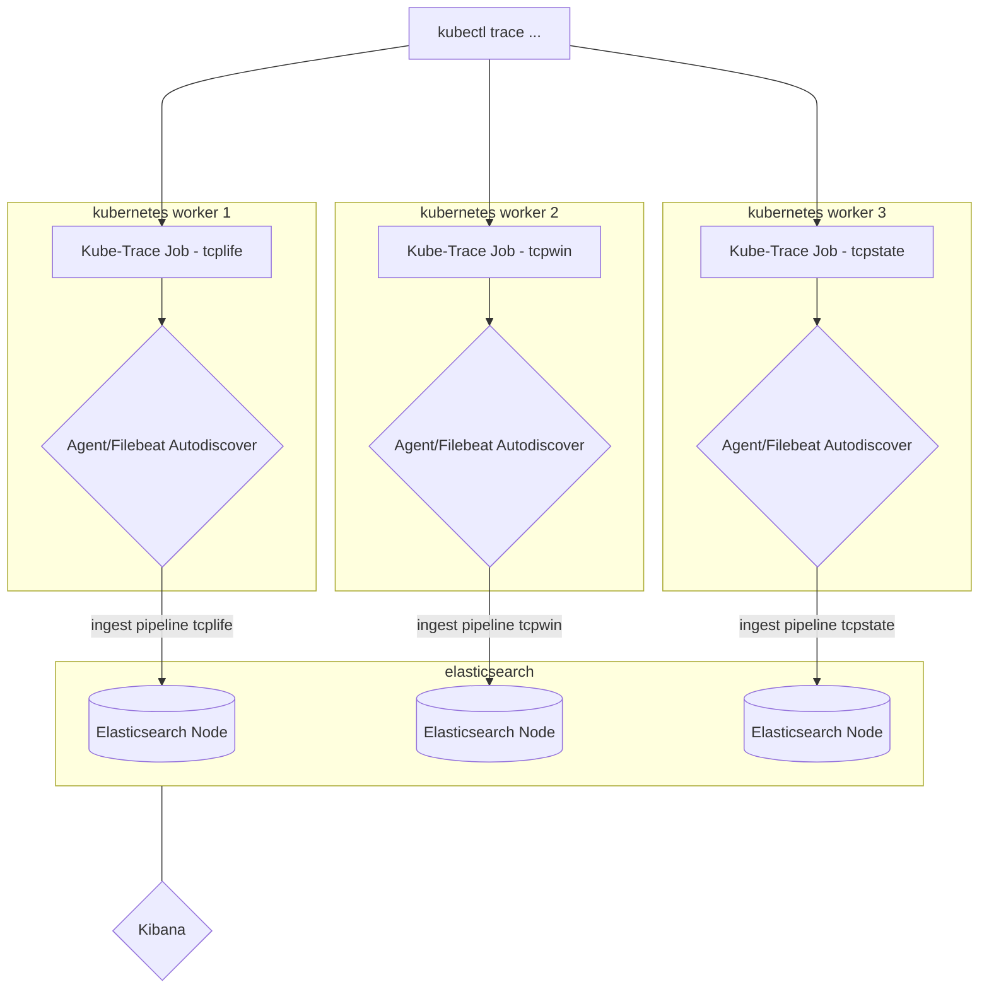

# elastic-kube-trace

# Elasticsearch and Kube-Trace

This was an effort to use [kube-trace](https://github.com/iovisor/kubectl-trace) with Elasticsearch to visualize results from bpftrace expressions and outputs. Sometimes the BPF based information is useful but hard to parse at scale, especially if you want to run it across a series of nodes at once and look for nuances or anomolies. I attempted to realize this with a straightforward architecture that could be expanded far beyond this modest attempt focused on TCP connection data.

### Prerequisites

- Kube-Trace installed (latest, =<0.1.2) around your kubectl CLI and compatable environment (modern kernel, not disabled, etc)
- ECK Operator installed
- Elasticsearch Cluster + Filebeat + Kibana deployed

### Basic Architecture

Kubectl trace will deploy the es-* bpftrace scripts as it should and Filebeat's autodiscovery will automagically pick up the logs from each Job that runs.  This will be run through an ingest pipeline to be parsed correctly and then sent to be indexed and viewed. Hopefully, this could be used for dynamic exploration and effective troubleshooting.

The scripts are essentially straight from the iovisor bpftrace repository with some adjustments made.  There are some core fields available and part of the twist on the original bpftrace scripts from the iovisor repo is adding some consistent fields so each document's data can be better tied together.  For example, you could take a source IP and track each node's sockets congestion window size or see network stats by each CPU Processor ID.  Each script also will print basic CSV formatted data described in each script and then get parsed via simple ingest pipelines when hitting the elastic Cluster. This is done with simplicity and ease of understanding, extensibility, and operation in mind.  You can edit the scripts or create new visualizaitons for whatever you'd like.

### Sample Workflow




### Usage

You need to deploy the Elastic cluster with Filebeat, login via Kibana, and install the ingest pipelines (and any dashboards if you'd like).  At this point you just need to run the kubectl trace ... command with the appropriate scripts targeted, a timer set (or not), and using the `--patch` flag, specify the correct label (which will be the script's base name so es-tcpaccept.bt will be tcpaccept) so that parsing can deal with it correctly. This will deploy a one off pod (a Job) to execute the bpftrace script against whatever node you targeted. Once it has run to expiration, it should terminate and the logs it generated captured by the local Beat. 

The data is routed from the ingest pipeline to a `filebeat-bpf-<name-of-script>-<daily-date>` pattern allowing you to segment and delete these dynamically captured events but also use them alongside your existing log inputs under the same data views in Kibana and correlate them against other data sources. 

Below is a sample command with a targeted bpftrace script and a label patch. 

```
#      --deadline int                Maximum time to allow trace to run in seconds (default 3600)
#      --patch string                path of YAML or JSON file used to patch the job definition before creation

kubectl trace run node/<node-name> -f tcpaccept.bt --deadline=60 --patch=~/tcpaccept_label_patch.yaml

```

All you need to extend this further is a modified or original bpftrace script, an ingest pipeline, a new condition in the filebeat config for the new label, and then build your own visualizations. This was purposefully meant to be simple and somewhat ephemeral for easy deployment and tear down. 


### Need to imminently add
- patch yamls
- ingest pipelines for all scripts
- dashboards

---

*If I have not given appropriate credit or recognition to anyone, please message me and I will fix it*
